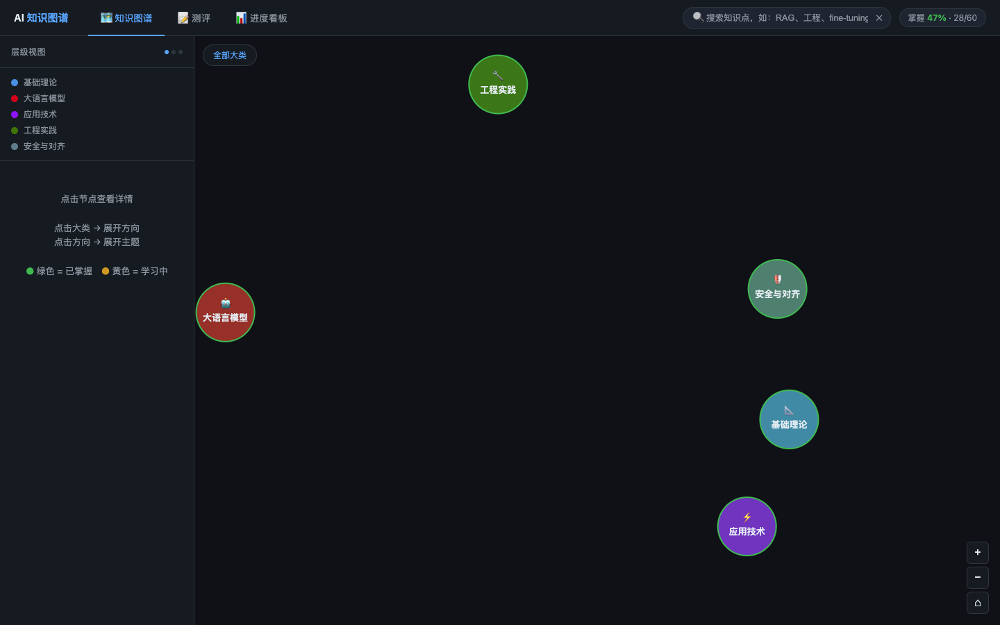

# AI 知识图谱

一个可本地运行的 AI / LLM / Agent 知识学习系统。通过交互式知识图谱、线性学习路径、诊断测评和进度追踪，帮助你系统掌握 AI 领域的核心知识体系。

面向 **AI 爱好者、半吊子技术人员和非技术背景的学习者**——不需要机器学习背景，从"会用"开始，按需深入原理。

**涵盖 5 大领域 · 15 个方向 · 67 个核心主题**



## 功能

### 知识图谱
- **全局总览**：三环放射布局，5 大类 + 15 方向 + 67 主题全部一屏可见，掌握状态实时着色
- **领域浏览**：逐层展开（大类 → 方向 → 主题），力导向图布局
- **路径导览**：按学习意图选择线性路径（详见下方）

### 学习路径
两条按**意图**划分的线性路径，每条 12 步，点击步骤直接跳转到图谱对应位置：

| 路径 | 适合人群 | 覆盖内容 |
|---|---|---|
| **会用** | 想把 AI 高效用起来 | LLM边界认知 → 提示工程 → RAG → Agent → MCP → Skill → 工作流自动化 |
| **懂原理** | 想理解 AI 底层机制 | 线性代数 → 神经网络 → Transformer → 预训练 → SFT → RLHF → PEFT |

### 测评系统
- **全局诊断**：30 题覆盖全部 15 个方向，生成雷达图 + 薄弱方向分析 + 推荐下一步
- **方向测评**：针对单一方向深度测评（每方向 12 题），题目按难度排序
- **后端验证**：答案不暴露给前端，服务端判分，防止直接作弊

### 其他
- **知识搜索**：模糊搜索名称、标签、描述，快速定位知识点（支持 MCP、Skill、RAG 等）
- **进度看板**：五大领域掌握度概览，已掌握 / 学习中 / 需要加强 / 未测评 四状态统计
- **日 / 夜主题**：顶部切换，偏好保存至本地
- **图例系统**：节点大小、连线类型、掌握状态完整说明

## 快速开始

**环境要求**：Python 3.8+，无需其他外部服务

```bash
# 1. 克隆项目
git clone <仓库地址>
cd super-alignment

# 2. 启动（首次运行自动创建虚拟环境并安装依赖）
bash run.sh
```

浏览器访问 [http://localhost:5001](http://localhost:5001)

> 首次启动会自动执行 `python3 -m venv venv` 和 `pip install -r requirements.txt`，无需手动操作。

## 手动安装（可选）

```bash
python3 -m venv venv
source venv/bin/activate        # Windows: venv\Scripts\activate
pip install -r requirements.txt
cd web && python app.py
```

## 项目结构

```
knowledge_graph/
├── vault/                    # 知识库（Markdown 格式）
│   ├── areas/      (5)       # 大类：基础理论、大语言模型、应用技术、工程实践、安全与对齐
│   ├── directions/ (15)      # 方向：如 RAG、Agent、提示工程、MLOps…
│   └── topics/    (67)       # 主题：每个文件含知识描述 + 选择题组
├── web/
│   ├── app.py                # Flask 后端 + API 路由
│   ├── vault_parser.py       # 数据解析、测评逻辑、状态管理
│   ├── data/                 # 运行时状态（state.json，不进 git）
│   ├── static/css/style.css  # 全局样式 + 日/夜主题
│   ├── static/js/app.js      # 图谱渲染、测评交互、路径导览
│   └── templates/index.html  # 单页应用入口
├── requirements.txt
└── run.sh                    # 一键启动脚本
```

## 知识结构

| 大类 | 方向 | 代表主题 |
|---|---|---|
| 基础理论 | 数学基础、机器学习、深度学习 | 线性代数、Transformer架构、监督学习 |
| 大语言模型 | 模型架构、训练与优化、推理部署 | 注意力机制、SFT、RLHF、模型量化 |
| 应用技术 | 提示工程、RAG、AI Agent | 上下文工程、RAG基础、MCP协议、Skill构建 |
| 工程实践 | 开发框架、MLOps、测评与质量 | AI辅助编程、模型选型、LangChain、成本优化 |
| 安全与对齐 | 对齐技术、AI安全、治理与伦理 | Constitutional AI、提示注入、数据隐私 |

## 扩展知识库

所有知识内容存储在 `vault/topics/`，每个主题是一个 Markdown 文件：

```markdown
---
id: your_topic_id
name: 主题名称
name_en: Topic Name
area: application
direction: agent
difficulty: 2          # 1-5，1最简单
importance: 5          # 1-5，5最重要
prerequisites: [agent_basics]
tags: [agent, mcp]
---

知识点描述（1-2句话）...

## Quiz

### Q1
**问题**: 题目内容？

- A. 选项A
- B. 正确选项  ✓
- C. 选项C
- D. 选项D

**解析**: 选B的原因...
```

按此格式在 `vault/topics/` 新增文件，重启服务即可自动加载。

## 技术栈

- **后端**：Python 3 + Flask 3，无数据库
- **前端**：原生 JavaScript + D3.js v7，无框架
- **数据**：Markdown + YAML frontmatter
- **状态**：本地 JSON 文件，每台机器独立

## 用户数据

学习进度保存在 `web/data/state.json`（已加入 `.gitignore`），不会上传至 git，每台机器独立存储。

## License

MIT
